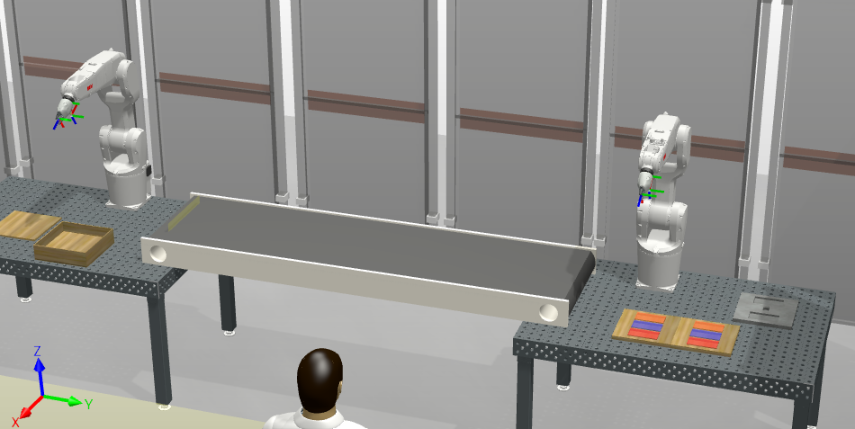

# VRM (Programming for Robots and Manipulators)
## Course description
[Subject](https://www.fme.vutbr.cz/en/studenti/predmety/261172) enables the students to acquire skills and knowledge of programming industry/mobile robots, manipulators and enables them to extend these skills, integration and deployment in real industry application.

## Projects
1. Seminar Paper
    - Wearable Robots 
2. Sorting line - ABB RobotStudio
3. Team Project

### Seminar paper: Wearable robots
*Abstract: This seminar paper presents the technology of wearable robots, mainly exoskeletons. Several examples
of exoskeletons in different fields are presented.*

## Project 1: Sorting Line - ABB RobotStudio
The simple sorting production line is designed with ABB RobotStudio. The input is the color of some part to be packed (each color has own position). Two parts of the same color are to be chosen from Table No.1 and sent to Table No.2 on the conveyor. Robotic arm on the Table No.2 then packs the part into container.

<figure>
    
    <figcaption>Task 2 - Production Line</figcaption>
</figure>

## Project 2: Team Project - Laboratory Cell -  Visual Components 4.3
The team had 4 members. The result of the project, created with Visual Components 4.3i, s a simulation of the laboratory cell for testing samples. The cell consists of several robots (eg. ABB Yumi) and conveyor lines for trasporting of samples.

<figure>
    
    <figcaption>Task 3 - Laboratory Cell</figcaption>
</figure>